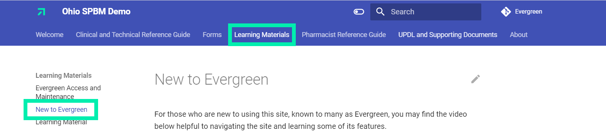

# Welcome

This is a digital documentation example for Gainwell Technologies, in support of the Ohio State Pharmacy Benefit Management activity.

==New to Evergreen?==

For those who are new to Evergreen, there is an introduction video available that displays many of the site's current tools and features. It can be found by clicking "Learning Materials" on the top navigation panel.

See the photo below for a visual explaing where to find this walkthrough video.

==Recent Update== (5/9/2023)

Documents under "UPDL and Supporting Documents" now contain new information pertaining to the drugs labeled, "BvG" (Brand Preferred over the Generic). 

If a drug in the "preferred drugs" category is listed as "BvG", then the generic drug in the "non-preferred drugs" category will be listed as "Brand Preferred". Hovering over a drug that is labeled with "Brand Preferred" will also display the brand preferred drug associated with it.

The photo below displays this new update. Please refer to the "Contact" button below if you have any questions or feedback relating to this update.

[Contact :material-message-cog:](https://github.com/gainwell-ohio/spbm/issues){ .md-button .md-button--primary target="_blank" rel="noopener"}

- Please navigate to the "Contact" button to request changes, communicate errors, ask questions, or provide any other related feedback.
- After navigating to the link, click "New Issue" to open a new comment or request.
