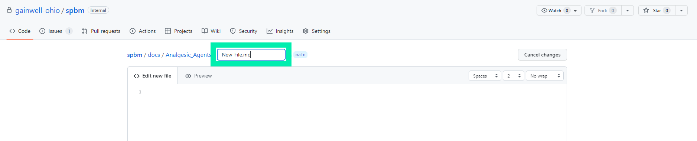
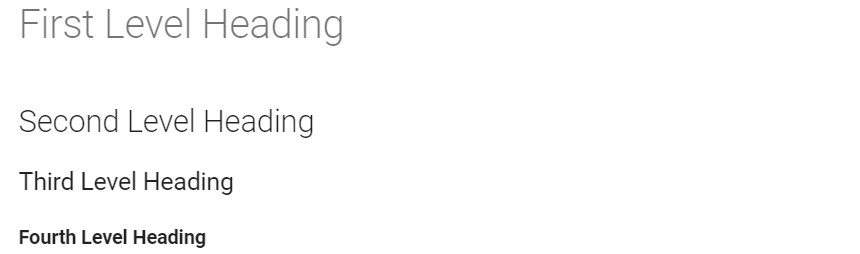

# Learning Material

## Contributing Changes to the Documentation

Making necessary changes and implementing updates to the documentation is simple and efficient. Instructions and helpful information on how to contribute changes to the documentation is explained throughout the following text. 
### Navigation from Site to Documentation

Clicking the pen icon as shown below, navigates the user to that specific document in the editing page, while clicking the "Ohio SPBM Docs" icon navigates users to the home page of the documentation repository where the user is able to locate documents through the navigation panel. 

Show below is the home page of the documentation repository. From here pull requests can be accessed to request and manage approvals by clicking the "Pull Requests" tab and navigating to the documentation folders and files is done so by accessing the "docs" folder. From there documents can be edited as the user wishes.

### Contributing Changes to Documents

By accessing the editing page, the contents of the document can be viewed as shown below, and those with permission can make edits to the documents when needed by navigating to the editing page which is accessed by clicking the pen at the top of the document.

Once the editor is opened, changes and updates can be made in any document. Changes to these documents are made through plain text and Markdown. Markdown is a lightweight formatting language that allows for additions of formatting elements to plain text documents. Simple notations are used to better format text and build structure within documents. The Markdown syntax is more thoroughly explained in the section titled "Markdown Syntax".

Switching between the editing and viewing tabs is also available which gives users the ability to easily view and ensure the correctness of the the changes being made.

Also available in the editor page, is the ability to see who has made what changes and when the changes were made. By navigating to the "blame" button in the desired document, users are able to see the entire log of changes and additions made to the document. 

### Committing Changes to be Approved

Once the necessary modifications of the documentation have been made, the changes must be committed or requested to be implemented. Committing changes is done so by scrolling to the bottom of the editor page and locating the commit area or pressing "Ctrl + S" to be navigated there immediately.

Adding a comment or title pertaining to the information modified is available in the commit area. This step is important in explaining to others the changes made and the reason for doing so. 

After the final modifications have been made and a comment has been added, the "commit changes" button can be pressed to push the newly modified documents and request approval for the permanent change. 

### Creating an Additional Section

If new information is needing to be added that requires an additional page, new sections can be created. To do so, first navigate the folder where the new section needs to be added.

 The user then can click the 'Create new file' from the 'Add file' drop-down menu. Be sure to create the new file in the correct folder or the file will not be located correctly in the navigation pane on the site.

Once the new file is created, assign the proper name the file and follow it with ".md". This allows the Markdown language to be read correctly along with the plain text.

## Markdown

Markdown is the language used in the documentation to better format and add structure to the plain text. Simple notations are added to the text to apply these formatting elements. The syntax is better explained in the following text.

### Headings 

Headings are creating by inputting hash marks before the desired heading text. The number of hash marks corresponds with the heading level of the text.

 - \# First Level Heading
 - \#\# Second Level Heading
 - \#\#\# Third Level Heading
 - \#\#\#\# Fourth Level Heading 

Displayed below is the outcome of using the correct Markdown syntax for creating headings.

### Lists

Lists are easily created using numbers or hyphens based on if the list is ordered or unordered. Indenting the syntax elements nests the list. Keyboard shortcuts are also available in creating lists. Pressing "Ctrl + Shift + 7" creates an ordered list, while pressing "Ctrl + Shift + 8" creates and unordered list.

- \- unordered list
- \- additional item on unordered list
- 1\. ordered list
- 2\. additional item on ordered list  

Displayed below is the outcome of using the correct Markdown systax for creating lists.

### Bold Text

Adding bold formatting to text is simply done by wrapping the text with two asterisks on each side of the text. A keyboard shortcut is also available to create bold text which can be utilized by pressing "Ctrl + B".

\*\*Bold Text**

### Tables

Creating and managing a table using Markdown requires a few syntax additions in order to display the correct formatting. A table is made up of vertical slashes, hyphens, and the desired text. The top line with information holds the column titles and the lines below the hyphens is where the rest of the content in the table belongs. Increasing the amount of vertical slashes increases the amount of columns formed in the table. The line with hyphens and vertical slashes is necessary to create the table as well. Inserting three hyphens together in between vertical slashes for the amount of columns in the desired table is required to execute the correct formatting. The use of colons implements text alignment preferences to the table.

- | Correctly | Formatted | Table |
- | :--- | :---: | ---: |
- | information | inserted | here |
- | 1 | 2 | 3 |

Displayed below is the outcome of using the correct Markdown syntax for forming a table.

### Links

Inserting links into the documentation is done by putting the desired title of the link in brackets and then putting the link in parenthesis. Doing so causes the actual link to be hidden and shows only the link title formatted as blue clickable text.

- \[link here](inserted-link)

## Managing Approvals 

The following text provides instructions and guidance on managing approvals and navigating pull request related tools. Knowledge of these areas is important in reviewing and requesting changes as well as accepting and merging the requests if permitted to do so. 

### Navigation of Pull Requests

To review all pull requests that have been made, visit the pull request tab.

This page will display all open pull requests. The requests can be filtered by author, label, project, milestone, reviews, assignes, or a general sort. The user can select the pull request they wish to review and approve.

### Including Details to the Request

On the selected pull request, additional information can be included on the right. For example, if the pull request is an enhancement as opposed to a bug fix, then the label can be changed to accurately represent what the pull request is achieving. Including this information also allows for accurate sorting of the pull request as explained previously. The user can also review the file by selecting the "Files Changed" tab at the top.

### Reviewing and Approving Files Changed

Accessing the "File Changed" tab allows the user to look at a list of all files included in the request. Red highlighting displays the content that is in the original file, while the green highlighting represents the new change. By clicking the review changes button, the user can make comments and give feedback pertaining to the files, approve of the changes, or request that the author make additional edits.  

### Alternate Method of Approving Requests

Back on the "Conversation" tab of the pull request, the user can scoll to the bottom of the page and approve of the merge request from here as well.

Clicking the "Merge pull request" button will prompt the user with this dialogue box. Here the merge can be given a title and description. Confirming the merge will upload the changes to the branch.

## Pipeline To Explain Automation Flow

The process that has been developed follows Continuous Integration and Continuous Deployment (CI/CD) principles. New changes can be continuously integrated which allows for the ease of editing pages. For each change made and committed to the development branch, a GitHub actions file deploys the changes to the site.

### GitHub Actions

By clicking the actions tab, you can view the GitHub action as it builds and deploys the site after a commit has been made. Actions with a green circle represent that the action was successful, and the changes should now be present.

Along with that, if there are any errors that occur you will see the a line with a red circle. Clicking these will reveal why the actions file failed.

### Branches

The repository is broken into two branches: "development" and "main". Initial changes to the project will be sent to the development branch and will be hosted on GitHub Pages. This page can be visited by selecting the "Settings" tab at the top, "Pages" tab on the left, and then the link presented is the URL for the website.

Merges of the development branch to the main branch will invoke a different GitHub actions file which will deploy on AWS which hosts the main site.