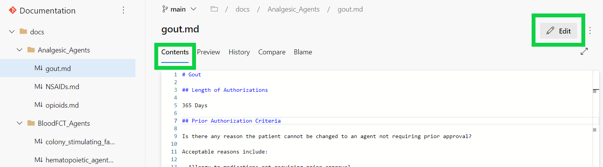

### Updating and Making Adjustments to Documentation

## Contributing Changes to Documents

Changes to these documents are made through Markdown. Markdown is a lightweight formatting languange that allows for additions of formatting elements to plain text documents. Simple notations are used to better format text and build structure within documents. 

Clicking the pen icon as shown below, will navigate the user to that specific document in the editing page, while clicking the "Ohio SPBM Docs" icon will navigate users to the home page of the editing page where the user can then locate documents through the navigation panel. 

By accessing the editing page, the contents of the document can be viewed as shown below, and those with permission can make edits to the documents when needed.

## Managing Major Changes within Documents

## Managing Approvals 