### Updating and Making Adjustments to Documentation

Making necessary changes and implementing updates to documents is simple and efficient. Instructions and helpful information on how to contribute changes is explained throughout the following text.

Clicking the pen icon as shown below, navigates the user to that specific document in the editing page, while clicking the "Ohio SPBM Docs" icon navigates users to the home page of the editing page where the user is able to locate documents through the navigation panel. 

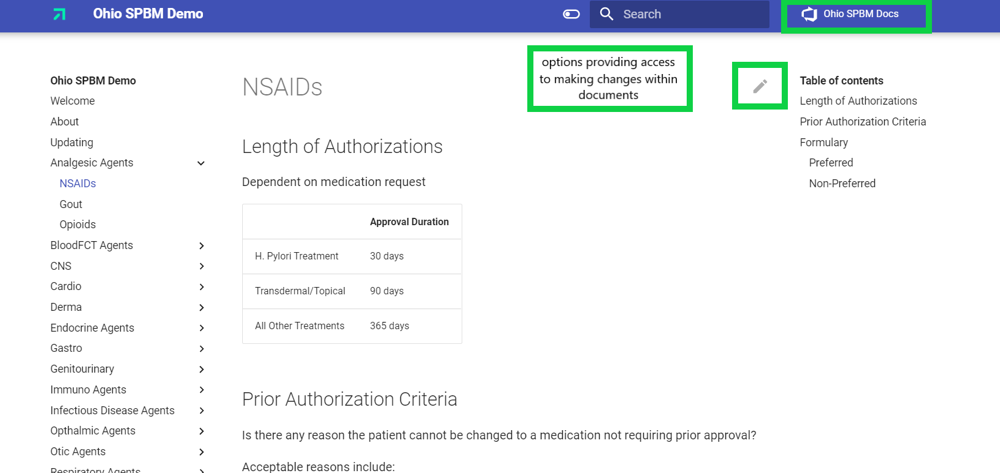

By accessing the editing page, the contents of the document can be viewed as shown below, and those with permission can make edits to the documents when needed by navigating to the editing page which is accessed by clicking the pen at the top of the document.

Once the editor is opened, changes and updates can be made in any document. Changes to these documents are made through Markdown. Markdown is a lightweight formatting language that allows for additions of formatting elements to plain text documents. Simple notations are used to better format text and build structure within documents. The Markdown syntax is more thoroughly explained in text further below.

Switching between the editing and viewing tabs is also available which gives  users the ability to easily view the changes being made.

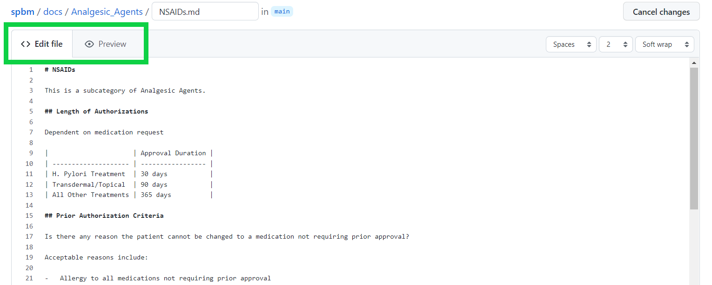

## Contributing Changes to Documents

Once the necessary modifications of the documentation have been made, the changes must be committed or requested to be implemented. Committing changes is done so by scrolling to the bottom of the editor page and locating the commit area or pressing "Ctrl + S" to be navigated there immediately.

Adding a comment or title pertaining to the information modified is available in the commit area. This step is important in explaining to others the changes made and the reason for doing so. 

After the final modifications have been made and a comment has been added, the "commit changes" button can be pressed to push the newly modified documents and request approval for the permanent change. 

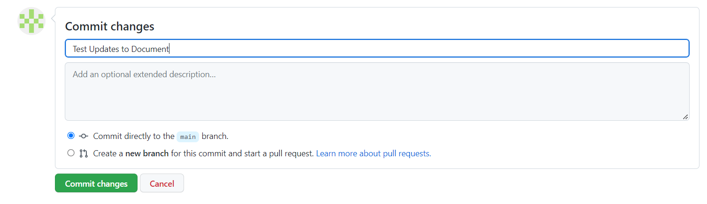

Also available in the editor page, is the ability to see who has made what changes and when the changes were made. By navigating to the "blame" button in the desired document, users are able to see the entire log of changes and additions made to the document. 

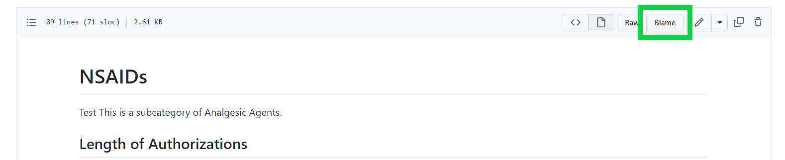

## Markdown Syntax

### Headings 

Headings are creating by inputting hash marks before the desired heading text. The number of hash marks corresponds with the heading level of the text.

 - \# First Level Heading
 - \#\# Second Level Heading
 - \#\#\# Third Level Heading
 - \#\#\#\# Fourth Level Heading 

Displayed below is the outcome of using the correct Markdown syntax for creating headings.

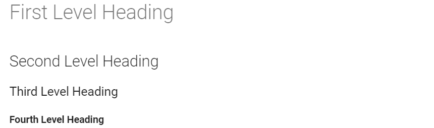

### Lists

Lists are easily created using numbers or hyphens based on if the list is ordered or unordered. Indenting the syntax elements nests the list. Keyboard shortcuts are also available in creating lists. Pressing "Ctrl + Shift + 7" creates an ordered list, while pressing "Ctrl + Shift + 8" creates and unordered list.

- \- unordered list
- \- additional item on unordered list
- 1\. ordered list
- 2\. additional item on ordered list  

Displayed below is the outcome of using the correct Markdown systax for creating lists.

### Bold Text

Adding bold formatting to text is simply done by wrapping the text with two asterisks on each side of the text. A keyboard shortcut is also available to create bold text which can be utilized by pressing "Ctrl + B".

\*\*Bold Text**

### Tables

Creating and managing a table using Markdown requires a few syntax additions in order to display the correct formatting. A table is made up of vertical slashes, hyphens, and the desired text. Increasing the amount of vertical slashes increases the amount of columns formed in the table. The use of colons implements text alignment preferences to the table.

- | Correctly | Formatted | Table |
- | :--- | :---: | ---: |
- | information | inserted | here |
- | 1 | 2 | 3 |

Displayed below is the outcome of using the correct Markdown syntax for forming a table.

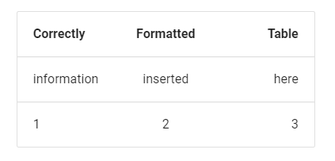

## Managing Approvals 

=======
To review all pull requests that have been made, visit the pull request tab.

This page will show you all open pull requests. You can filter these by the author, label, project, milestone, reviews, assignes, or a general sort. Then you can select the pull request you wish to review and approve.

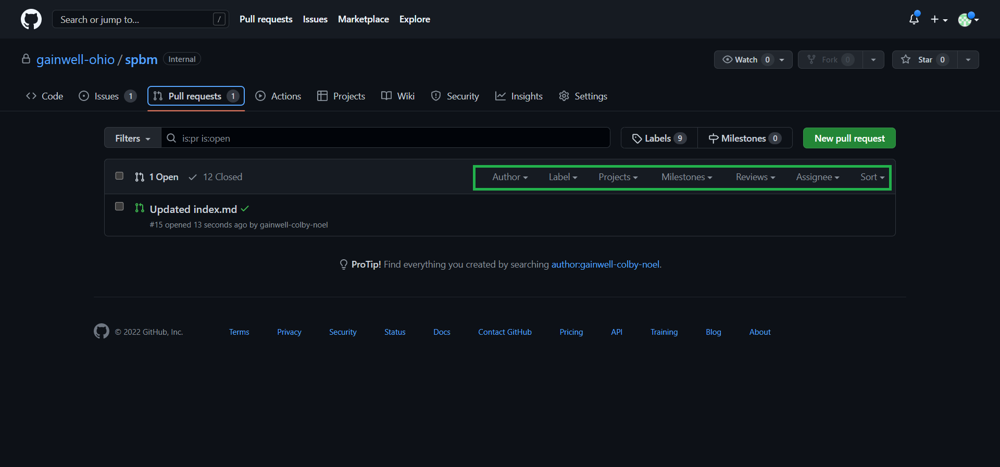

On the selected pull request, you can update any of the information on the right. For example, if this is an enhancement as opposed to a bug fix, then you can change the label to accurately represent what the pull request is achieving. Also, you can review the file by selecting the files changed tab at the top.

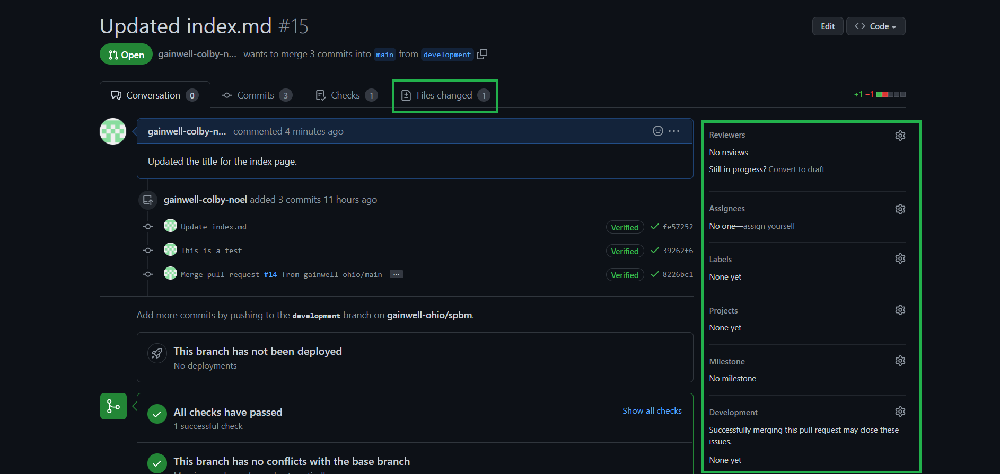

The Files Changed tab allows you to look at a list of all files in the request. Highlighted in red is the line that was in the original file, the green represents the new change. By clicking the review changes button, you can make comments about the files, approve of the changes, or request that the author of the changes make additional edits.  

Back on the conversation tab of the pull request, you can scoll to the bottom and approve of the merge request from here as well.

Clicking the "Merge pull request" button will prompt you with this dialogue box. Here you can give the merge a title and description. Confirming the merge will upload the changes to the branch.

## Pipeline To Explain Automation Flow

The process that's been developed follows Continuous Integration and Continuous Deployment (CI/CD) principles. By allowing for the ease of editing of these pages, we can continuously integrate new changes. For each change that we make and commit to the development branch, a GitHub actions file will deploy the changes to the site.

By clicking the actions tab, you can view the GitHub action as it builds and deploys the site after a commit has been made. Actions with a green circle represent that the action was successful, and the changes should now be present.

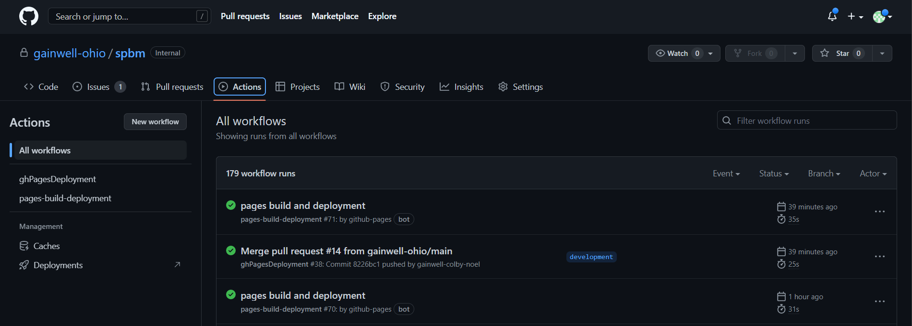

Along with that, if there are any errors that occur you will see the a line with a red circle. Clicking these will reveal why the actions file failed.

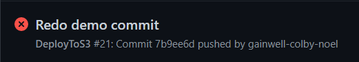
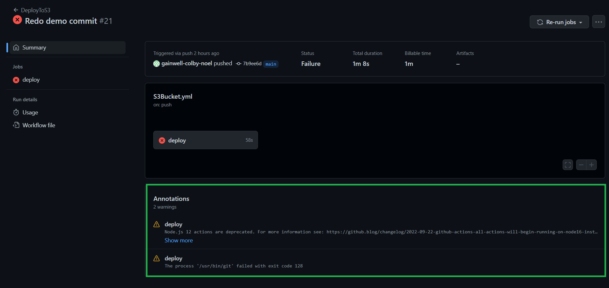

The repository is broken into two branches: development and main. Initial changes to the project will be sent to the development branch and will be hosted on the GitHub Pages. This page can be visited by selecting the Settings tab at the top, Pages tab on the left, and then the link presented is the URL for the website.

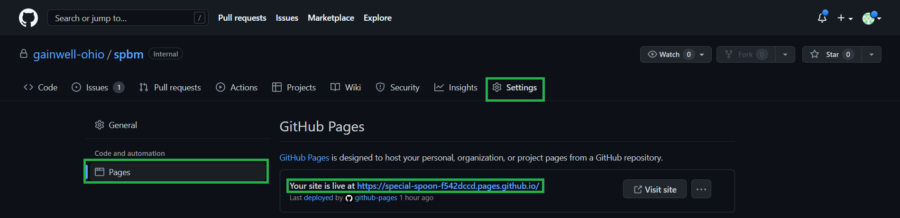

Merges of the development branch to the main branch will invoke a different GitHub actions file which will deploy on AWS which hosts the main site.
>>>>>>> 1526cdd82135136858cc39180bd997e94596e92e

Merges of the development branch to the main branch will invoke a different GitHub actions file which will deploy on AWS which hosts the main site.